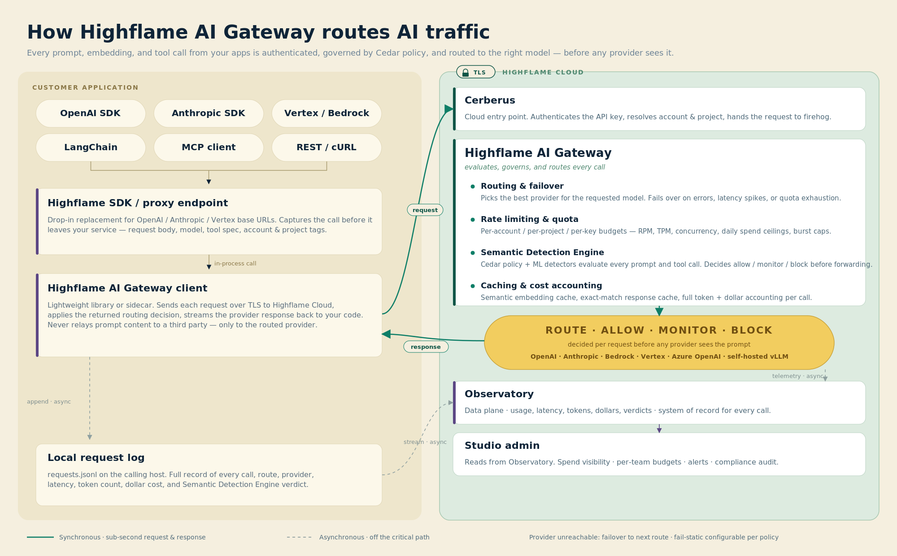
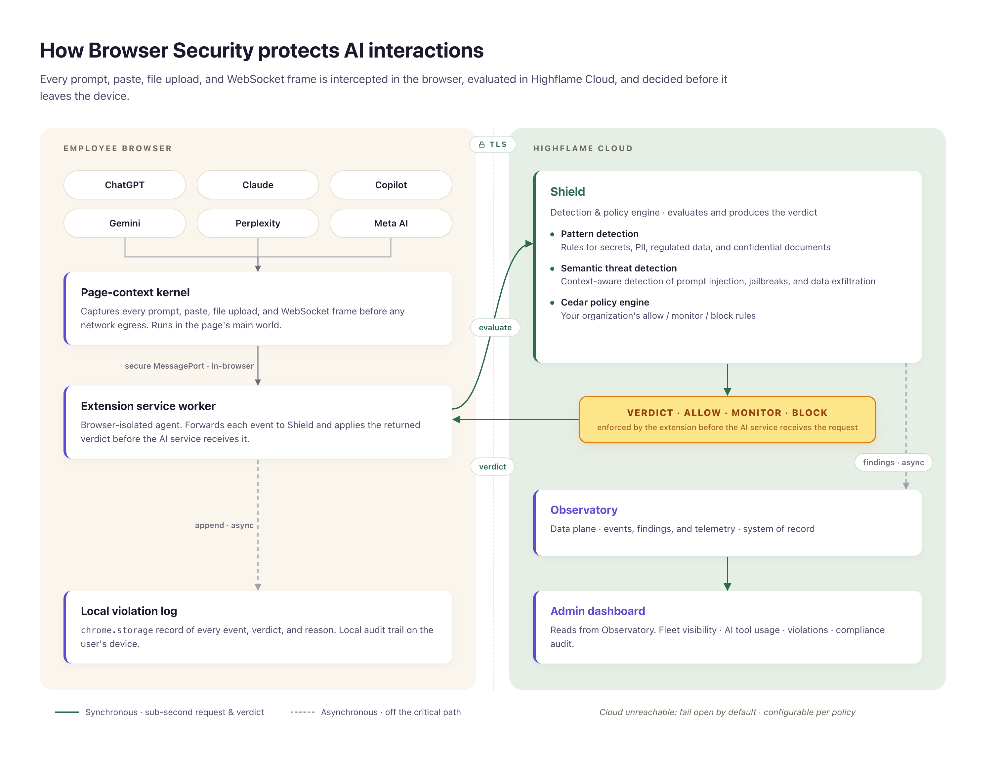
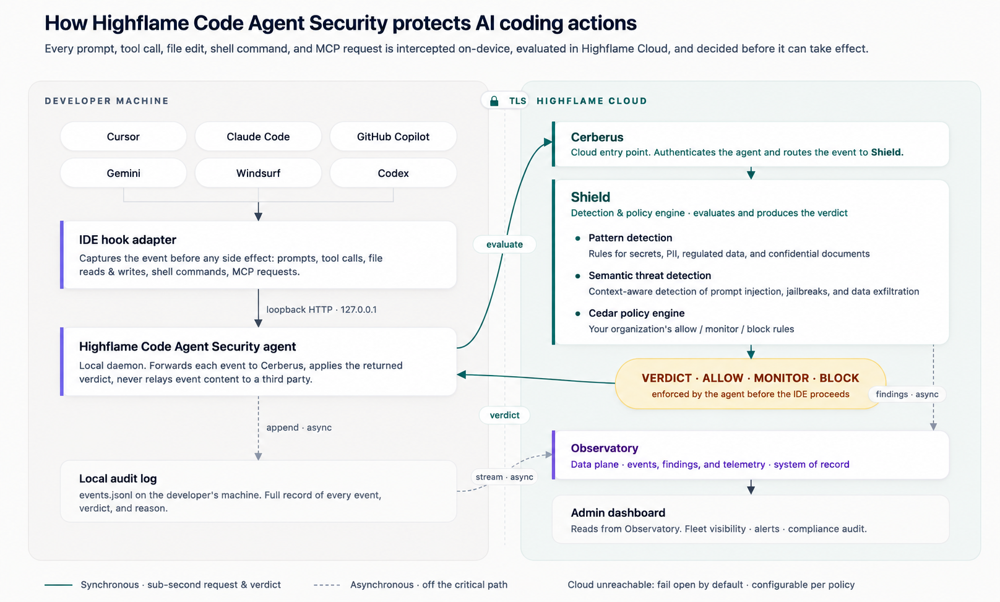

## AI Gateway Service Architecture

This diagram shows how Highflame AI Gateway authenticates, governs, routes, and observes AI traffic from customer applications before requests reach model providers.

## Browser Security Service Architecture

This diagram shows how Highflame Browser Security intercepts prompts, uploads, pastes, and WebSocket frames inside the browser, evaluates them in Highflame Cloud, and applies a verdict before the AI service receives the request.

## Code Agent Security Service Architecture

This diagram shows how Highflame Code Agent Security intercepts AI coding actions from developer tools, evaluates them through Highflame Cloud, and returns a verdict before local side effects proceed.

